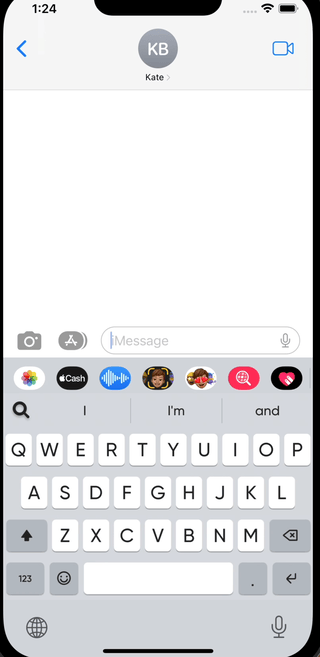
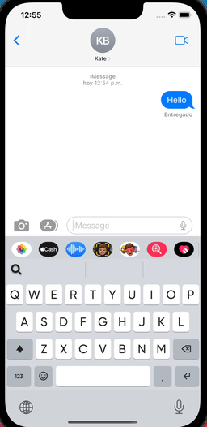

## About

The FleksySDK is versatile and can be employed for various purposes. Within this folder, we will demonstrate multiple ways to use the SDK to create your own virtual keyboard.

## Getting Started

Each folder has a different example per platform.

### Open View

When a trigger action occurs, a view will appear over the virtual keyboard.

💥 Trigger Action: We have three main types of trigger actions: 
  1. When a text is typed. 
  2. When a result from an API request has to be shown to the user. 
  3. When the user presses directly a button.
  
👀 View over the keyboard: We can show a view over the keyboard in different shapes:
  1. Full View that covers all the keyboard. We call this fleksyapp, which is a complete view for creating anything. 
  2. Frame View which is shown on top of the virtual keyboard view.

[**Open View Example**](open-view/ios/KeyboardOpenView)

The example we created triggers when the user presses a button and shows a full view over the keyboard. 
What you will achieve:

    

[**Frame View With TextField Example**](open-view/ios/KeyboardFrameWithTextField)

In the following example, we demonstrate a way to display a view on top of the keyboard with a textfield. When the frame view appears on top of the keyboard, the context is automatically switched to the internal textfield. When the frame view is closed, the cursor is automatically switched back to the textfield of the app.
Note: the user can manually switch between the app textfield and the keyboard's textfield by tapping on the textfield.

What you will achieve:

    

